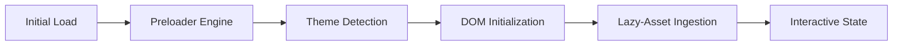

# GLANCE. | The Art of Sight

<p align="center">
  <strong>An Immersive Photography Portfolio Engine & Visual Storytelling Platform.</strong>
</p>

<p align="center">
  Glance is a high-performance, minimalist front-end architecture designed to bridge the gap between high-density visual content and seamless user experience.
</p>

<p align="center">
  
  
  
  
  
</p>

## Table of Contents

- [What Glance Is](#what-glance-is)
- [Design Philosophy](#design-philosophy)
- [Core Engineering Features](#core-engineering-features)
- [System Architecture](#system-architecture)
- [Repository Layout](#repository-layout)
- [Tech Stack](#tech-stack)
- [Local Setup](#local-setup)
- [Author](#author)

## What Glance Is

**Glance** is a curated digital gallery engineered for photographers and visual artists who demand a "Zero-Distraction" interface. In an era of cluttered web design, Glance prioritizes the **Content-First** approach, utilizing an "Industrial-Minimalist" framework to showcase high-resolution imagery without compromising on load speeds or perceptual performance.

Key deliverables:
1. **Dynamic Narrative:** A 7-stage Hero Slider for high-impact brand storytelling.
2. **On-Demand Loading:** An optimized gallery "Load More" system to minimize initial DOM weight.
3. **Adaptive Atmosphere:** Native Dark Mode integration for varied lighting environments.
4. **Immersive Focus:** A custom-built Lightbox portal for deep-dive image inspection.

## Design Philosophy

Glance isn't just a template; it's a study in **Perceptual Speed** and **Ocular Comfort**:

- **The "Nordic" Aesthetic:** Clean typography (Lexend) and generous white space reduce cognitive load.
- **Micro-Interactions:** Subtle CSS transforms and event-driven animations provide tactile feedback without being intrusive.
- **The "Midnight" Logic:** Theme switching isn't just a color swap—it uses CSS Variables (`--bg-color`, `--text-color`) to maintain design tokens consistently across the entire DOM tree.

## Core Engineering Features

### 1. Adaptive Navigation Hub
A sticky, backdrop-filtered navigation bar that utilizes "Smart-Scroll" logic to stay accessible while maintaining transparency for visual immersion. Includes a CSS-only animated hamburger transition for mobile states.

### 2. State-Aware Hero Slider
A robust slider engine featuring:
- Automatic interval transitions.
- Manual override via dynamic dot-navigation and directional controls.
- "Fade-Through" logic to prevent visual jarring during image swaps.

### 3. Tactical Gallery Grid
- **Lazy-Load Methodology:** Utilizes native `loading="lazy"` to preserve bandwidth.
- **Dynamic Ingestion:** A "Load More" mechanism that prevents browser bottlenecks by only rendering additional assets upon user intent.
- **Event Delegation:** The Lightbox uses a single event listener on the gallery container to manage dozens of items, significantly reducing memory overhead.

## System Architecture

### Frontend Workflow


## Repository Layout

```
Image-Slider-Gallery/
├── index.html         
├── style.css           
├── script.js         
└── README.md          
```

## Tech Stack

- **Markup:** Semantic HTML5 (Accessibility-first)
- **Styling:** CSS3 Custom Properties (Variables) & Flex/Grid Orchestration
- **Logic:** Vanilla JavaScript (ES6+ Primitives)
- **Typography:** Google Fonts (Lexend)
- **Icons:** FontAwesome 6.4 (Vector-based)
- **Imagery:** High-Fidelity Unsplash API placeholders


## Local Setup

### 1. Clone the Environment
Copy the repository to your local machine:

```
git clone https://github.com/ABDUL-RAHMAN-9/Image-Slider-Gallery.git
```

### 2. Navigate to Directory

```
cd Image-Slider-Gallery
```

### 3. Launch the Project

Since this is a front-end project, you can run it instantly:

- **Using VS Code:** Right-click `index.html` and select **"Open with Live Server"**.
- **Using Python:** Run `python -m http.server 8000` and visit `localhost:8000`.

## Author

Built by **[Abdul Rahman](https://github.com/ABDUL-RAHMAN-9)**  

